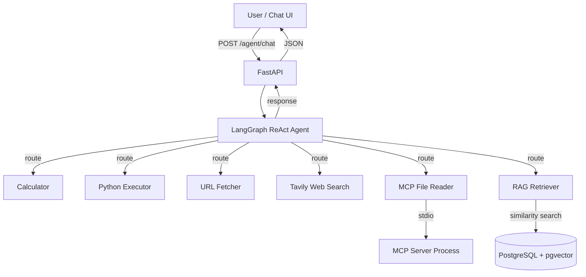

# AgentMCP

[](https://python.org)
[](https://fastapi.tiangolo.com)
[](https://github.com/langchain-ai/langgraph)
[](https://docs.docker.com/compose/)
[](https://modelcontextprotocol.io)

**A LangGraph ReAct agent with MCP tool integration, RAG retrieval, and structured observability -- deployable with a single command.**

---

## Architecture



The agent receives a user message, reasons about which tools to invoke using the ReAct pattern, executes one or more tool calls, and synthesizes a final response. Tools come from three integration patterns: **native LangGraph tools** (calculator, python executor, URL fetcher, web search), **MCP protocol tools** (file reader via stdio transport), and **RAG retrieval** (pgvector similarity search). A built-in chat UI at `/` provides a browser-based interface with conversation memory, document upload, and execution trace viewing.

---

## Why I Built This

I have hands-on experience building AI agent orchestration systems and multi-model pipelines in production environments, along with published research (IEEE) on applied machine learning. This project distills those patterns into a clean, self-contained demonstration: a ReAct agent that routes between native tools and MCP-protocol tools, retrieves context from a vector store, and logs every decision with structured observability. It is designed to show production thinking -- graceful degradation when services are unavailable, clean separation of concerns between agent logic and API surface, and infrastructure that runs with a single command.

---

## Features

- **ReAct Agent** -- LangGraph state machine with explicit tool routing and multi-step reasoning
- **6 Tools** -- Calculator, sandboxed Python executor, URL content fetcher, Tavily web search, MCP file reader, RAG retriever
- **MCP Integration** -- File reader server using the Model Context Protocol (stdio transport)
- **RAG Pipeline** -- Document ingestion, chunking, embedding, and similarity search via pgvector
- **Chat UI** -- Browser-based interface at `/` with dark/light theme, conversation memory, document upload, and execution trace viewer
- **Conversation Memory** -- Per-session message history via LangGraph's MemorySaver checkpointer
- **Structured Observability** -- JSON-structured logging of every agent step, tool call, and latency
- **Execution Tracing** -- Per-request trace endpoint (`/agent/trace/{run_id}`) showing LLM decisions and tool calls
- **Graceful Degradation** -- Agent runs with reduced capabilities if MCP or vectorstore are unavailable
- **LLM Gateway Support** -- Works with OpenAI directly or any OpenAI-compatible proxy (LiteLLM, Azure, etc.) via `OPENAI_API_BASE`
- **Docker Deployment** -- Full stack (FastAPI + PostgreSQL/pgvector) in one `docker-compose up`
- **Clean API** -- Typed request/response schemas, OpenAPI docs auto-generated at `/docs`

---

## Quick Start

### Prerequisites

- [Docker](https://docs.docker.com/get-docker/) and [Docker Compose](https://docs.docker.com/compose/install/)
- An [OpenAI API key](https://platform.openai.com/api-keys)
- (Optional) A [Tavily API key](https://tavily.com) for web search

### Setup

```bash
# Clone the repository
git clone https://github.com/your-username/agent-mcp.git
cd agent-mcp

# Configure environment
cp .env.example .env
# Edit .env and set your OPENAI_API_KEY (required)
# Optionally set TAVILY_API_KEY for web search

# Start everything
docker-compose up --build
```

### Verify

```bash
curl http://localhost:8000/health
```

Expected response:

```json
{
  "status": "healthy",
  "database": { "connected": true, "error": null },
  "pgvector": { "installed": true }
}
```

Open [http://localhost:8000](http://localhost:8000) for the chat UI, or [http://localhost:8000/docs](http://localhost:8000/docs) for the API documentation.

### Using a Custom LLM Gateway

To route LLM calls through LiteLLM, Azure OpenAI, or any OpenAI-compatible proxy, set `OPENAI_API_BASE` in your `.env`:

```bash
OPENAI_API_KEY=your-proxy-key
OPENAI_API_BASE=http://your-litellm-proxy:4000/v1
MODEL_NAME=gpt-4.1-mini
```

---

## Demo Scenario

Try these three requests to see the agent use different tools in sequence.

### 1. Calculator -- Math Reasoning

```bash
curl -s -X POST http://localhost:8000/agent/chat \
  -H "Content-Type: application/json" \
  -d '{"message": "What is (245 * 18) + (372 / 4)?"}' | jq
```

```json
{
  "response": "The result of (245 * 18) + (372 / 4) is 4503.0",
  "tools_used": ["calculator"],
  "metadata": { "duration_ms": 1200 }
}
```

### 2. Python Executor -- Code Execution

```bash
curl -s -X POST http://localhost:8000/agent/chat \
  -H "Content-Type: application/json" \
  -d '{"message": "Generate 5 secure random passwords with 16 characters each"}' | jq
```

The agent writes and executes Python code in a sandboxed environment (standard library only, 10-second timeout, dangerous modules blocked).

### 3. URL Fetcher -- Live Web Content

```bash
curl -s -X POST http://localhost:8000/agent/chat \
  -H "Content-Type: application/json" \
  -d '{"message": "Summarize https://news.ycombinator.com"}' | jq
```

The agent fetches the URL, extracts text content, and summarizes it.

### 4. RAG -- Document Retrieval

First, ingest a document:

```bash
curl -s -X POST http://localhost:8000/rag/ingest \
  -F "file=@your-document.pdf" | jq
```

```json
{
  "document_name": "your-document.pdf",
  "chunks_ingested": 42,
  "message": "Document ingested successfully"
}
```

Then ask the agent about it:

```bash
curl -s -X POST http://localhost:8000/agent/chat \
  -H "Content-Type: application/json" \
  -d '{"message": "What are the key findings from the ingested document?"}' | jq
```

The agent will use the `search_documents` tool to retrieve relevant chunks from the vector store and synthesize an answer.

---

## API Reference

| Method | Endpoint | Description |
|--------|----------|-------------|
| `GET` | `/` | Chat UI (browser interface) |
| `GET` | `/health` | Health check -- database and pgvector status |
| `POST` | `/agent/chat` | Send a message to the agent (triggers tool use) |
| `GET` | `/tools` | List all available tools and descriptions |
| `POST` | `/rag/ingest` | Upload and ingest a document into the vector store |
| `POST` | `/rag/query` | Direct similarity search against the vector store |
| `GET` | `/agent/trace/{run_id}` | Retrieve execution trace for a completed run |

All endpoints return structured JSON. Error responses follow a consistent format:

```json
{
  "error": "error_type",
  "detail": "...",
  "message": "Human-readable description"
}
```

---

## Testing

```bash
# Run unit tests (inside container)
docker-compose exec api pytest

# Run unit tests (local Python env)
pytest

# Run E2E tests against running stack (requires docker-compose up)
bash scripts/test_e2e.sh
```

### Test Coverage

| Suite | Tests | What it covers |
|-------|-------|---------------|
| `tests/test_tools.py` | 6 | Calculator (valid/invalid/edge), Tavily loader |
| `tests/test_agent.py` | 2 | Agent creation, tool integration |
| `tests/test_rag.py` | 3 | Text ingestion, retriever tool creation |
| `scripts/test_e2e.sh` | 7+ | Health, tools, calculator, file reader, RAG, tracing |

---

## Deployment

### Production Configuration

| Variable | Production Value | Notes |
|----------|-----------------|-------|
| `OPENAI_API_KEY` | Your real key | Required |
| `OPENAI_API_BASE` | Proxy URL (optional) | For LiteLLM, Azure, or other OpenAI-compatible gateways |
| `MODEL_NAME` | `gpt-4.1-mini` | Any model your provider supports |
| `DATABASE_URL` | Production Postgres URL | Use managed Postgres with pgvector |
| `LOG_JSON` | `true` | Structured logs for log aggregation |
| `LOG_LEVEL` | `INFO` or `WARNING` | Reduce noise in production |
| `TAVILY_API_KEY` | Your key | Optional -- agent degrades gracefully without it |

### Cloud Deployment

AgentMCP runs on any Docker-compatible platform:

1. **Build and push the image:**
   ```bash
   docker build -t agent-mcp .
   docker tag agent-mcp your-registry/agent-mcp:latest
   docker push your-registry/agent-mcp:latest
   ```

2. **Set environment variables** on your platform (Railway, Fly.io, AWS ECS, GCP Cloud Run)

3. **Provision PostgreSQL with pgvector** -- most managed Postgres providers support pgvector as an extension

4. **Expose port 8000** and point your domain/load balancer to it

---

## Tech Stack

| Technology | Purpose |
|------------|---------|
| Python 3.12 | Runtime |
| LangGraph | ReAct agent orchestration with memory checkpointer |
| FastAPI | REST API framework + static file serving |
| PostgreSQL 17 + pgvector | Vector store and database |
| langchain-mcp-adapters | MCP-to-LangGraph tool bridge |
| MCP SDK (stdio) | File reader server |
| Tavily | Web search tool |
| simpleeval | Safe math expression evaluation |
| structlog | Structured JSON logging |
| Docker Compose | Single-command deployment |

---

## Project Structure

```
agent-mcp/
├── src/
│   ├── main.py                  # FastAPI app, lifespan, error handlers
│   ├── agent/
│   │   ├── graph.py             # LangGraph ReAct agent factory
│   │   ├── tools.py             # Native tools (calculator, python executor, URL fetcher)
│   │   └── tracing.py           # Execution tracer callback handler
│   ├── api/
│   │   ├── routes_agent.py      # POST /agent/chat
│   │   ├── routes_health.py     # GET /health
│   │   ├── routes_rag.py        # POST /rag/ingest, POST /rag/query
│   │   ├── routes_tools.py      # GET /tools
│   │   └── routes_trace.py      # GET /agent/trace/{run_id}
│   ├── core/
│   │   ├── config.py            # Pydantic settings (env var loading)
│   │   └── logging.py           # structlog configuration
│   ├── mcp_servers/
│   │   └── file_reader.py       # MCP file reader server (stdio)
│   ├── rag/
│   │   ├── ingestion.py         # Document chunking and embedding
│   │   ├── retriever_tool.py    # RAG as a LangGraph tool
│   │   └── vectorstore.py       # pgvector initialization
│   └── schemas/
│       └── api.py               # Pydantic request/response models
├── tests/
│   ├── conftest.py              # Shared test fixtures
│   ├── test_tools.py            # Calculator and tool loader tests
│   ├── test_agent.py            # Agent creation and routing tests
│   └── test_rag.py              # RAG ingestion and retrieval tests
├── scripts/
│   ├── init-db.sh               # PostgreSQL pgvector extension setup
│   └── test_e2e.sh              # curl-based E2E test suite
├── data/
│   ├── sample.txt               # Demo file for MCP file reader
│   └── ieee_paper.txt           # IEEE paper for RAG demo
├── static/
│   └── index.html               # Chat UI (dark/light theme, trace viewer)
├── docker-compose.yml           # FastAPI + PostgreSQL/pgvector
├── Dockerfile                   # Python 3.12-slim based image
├── .env.example                 # Environment variable template
└── pyproject.toml               # Dependencies and project metadata
```

---

## License

MIT
